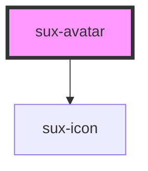

# sux-avatar

<!-- Auto Generated Below -->

## Properties

| Property   | Attribute   | Description                                               | Type                                                            | Default  |
| ---------- | ----------- | --------------------------------------------------------- | --------------------------------------------------------------- | -------- |
| `imageUrl` | `image-url` | The image url for the image to be displayed on the Avatar | `string`                                                        | `''`     |
| `initials` | `initials`  | optionally pass initials to display on the Avatar         | `string`                                                        | `''`     |
| `label`    | `label`     | pass an image alt text for accessibility                  | `string`                                                        | `''`     |
| `size`     | `size`      | specify the size of the Avatar, defaults to xxxl          | `"l" \| "m" \| "s" \| "xl" \| "xs" \| "xxl" \| "xxs" \| "xxxl"` | `'xxxl'` |

## Shadow Parts

| Part      | Description |
| --------- | ----------- |
| `"icon"`  |             |
| `"image"` |             |

## Dependencies

### Depends on

- [sux-icon](../sux-icon)

### Graph

----------------------------------------------

*Built with [StencilJS](https://stenciljs.com/)*
