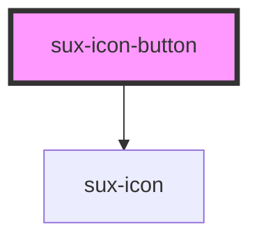

# sux-icon-button

<!-- Auto Generated Below -->

## Properties

| Property   | Attribute  | Description                                                                                                                                                                        | Type                                              | Default     |
| ---------- | ---------- | ---------------------------------------------------------------------------------------------------------------------------------------------------------------------------------- | ------------------------------------------------- | ----------- |
| `disabled` | `disabled` | is the button disabled                                                                                                                                                             | `boolean`                                         | `false`     |
| `href`     | `href`     | When set, the underlying button will be rendered as an <a> with this href instead of a <button>                                                                                    | `string`                                          | `undefined` |
| `label`    | `label`    | A description that gets read by screen readers and other assistive devices. For optimal accessibility, you should always include a label that describes what the icon button does. | `string`                                          | `undefined` |
| `library`  | `library`  | The Name of Registered Icon in the Library                                                                                                                                         | `string`                                          | `"default"` |
| `name`     | `name`     | Name of The Icon                                                                                                                                                                   | `string`                                          | `undefined` |
| `quiet`    | `quiet`    | Is quiet makes the button appear with least prominence.                                                                                                                            | `boolean`                                         | `false`     |
| `shape`    | `shape`    | specify the style of the icon button, defaults to default.                                                                                                                         | `"default" \| "round"`                            | `"default"` |
| `size`     | `size`     | specify the size of the icon button, defaults to m                                                                                                                                 | `"l" \| "m" \| "s" \| "xl"`                       | `"m"`       |
| `src`      | `src`      | Optionally provide external url for custom SVG icon                                                                                                                                | `string`                                          | `undefined` |
| `target`   | `target`   | When set, defines the target of the link                                                                                                                                           | `"_blank" \| "_parent" \| "_self" \| "_top"`      | `undefined` |
| `variant`  | `variant`  | specify the variant of the icon button, defaults to primary.                                                                                                                       | `"cta" \| "negative" \| "primary" \| "secondary"` | `"primary"` |

## Dependencies

### Depends on

- [sux-icon](../sux-icon)

### Graph

----------------------------------------------

*Built with [StencilJS](https://stenciljs.com/)*
